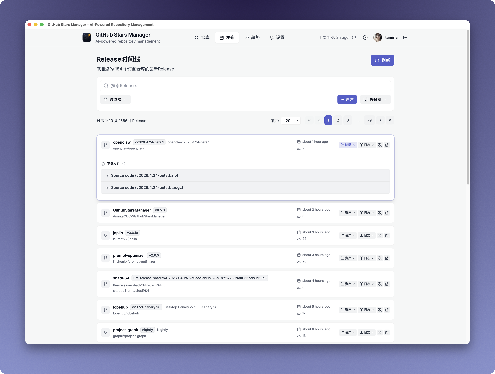
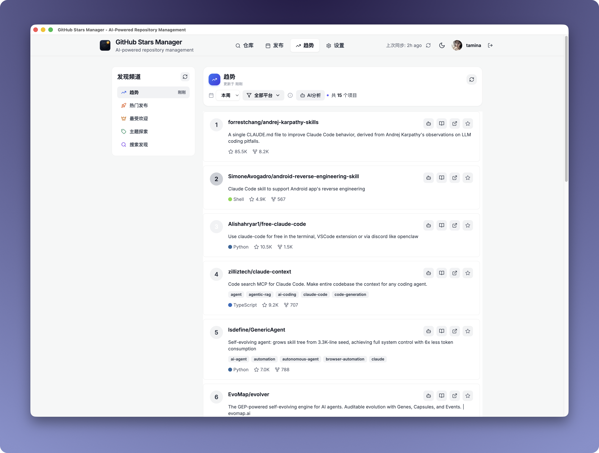
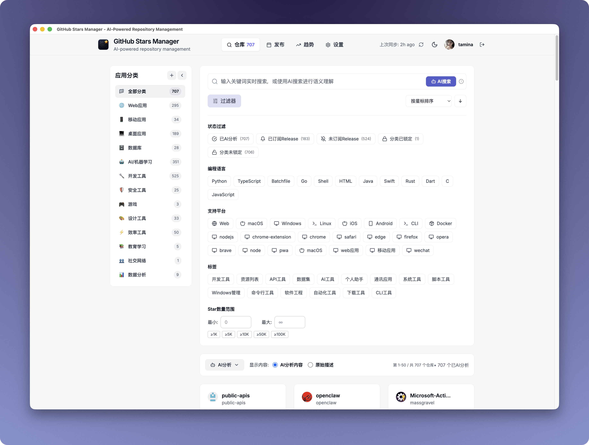
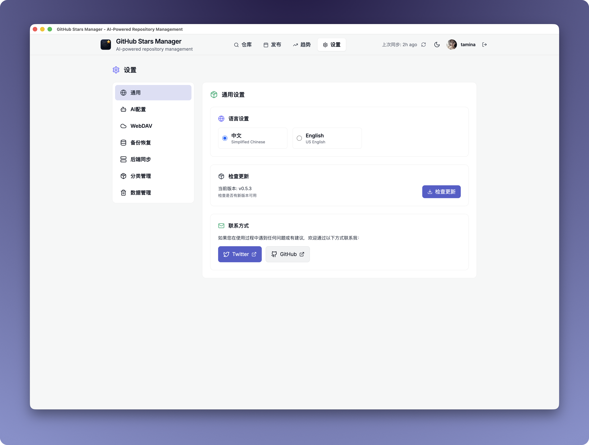
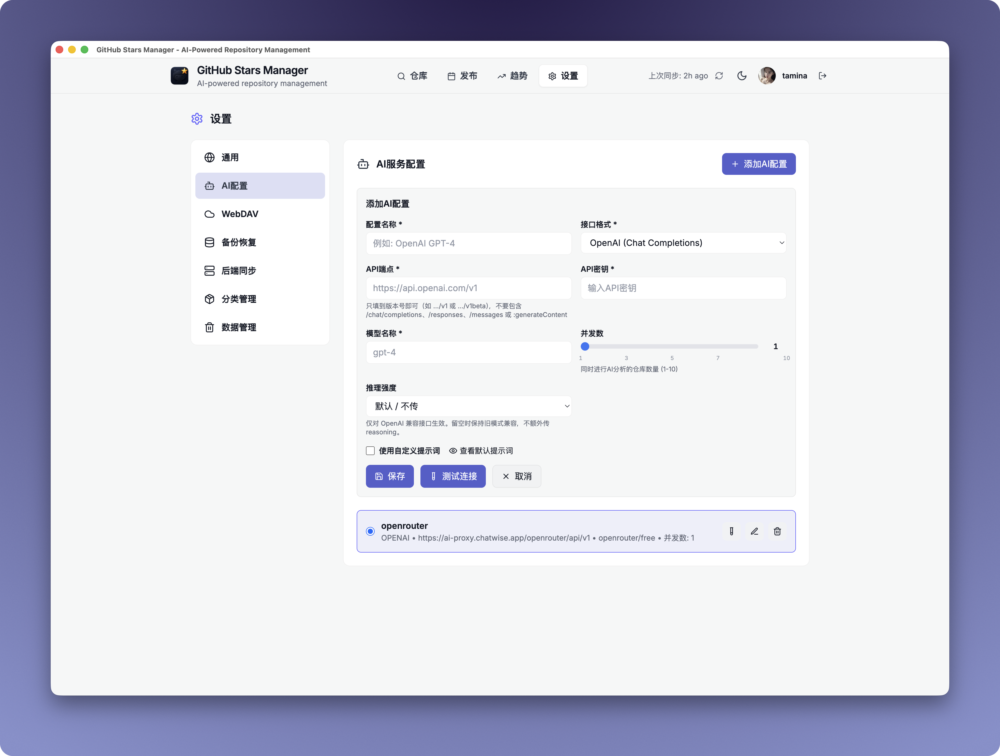

<div align="center">


# GithubStarsManager

  


An app for managing github starred repositories.

<a href="https://www.producthunt.com/products/githubstarsmanager?embed=true&utm_source=badge-featured&utm_medium=badge&utm_source=badge-githubstarsmanager" target="_blank"></a>

</div>

**[中文文档](README_zh.md)** | English


## ✨ Features

> Tired of starring everything and finding nothing?

GitHub Stars Manager automatically syncs your starred repos, uses AI to summarize and categorize them, and lets you find anything with semantic search. Track releases, filter assets, and one‑click download—smarter than manual tags, simpler than GitHub.

### Core Features

| Feature | Description |
|---------|-------------|
| **Auto-sync Stars** | Connect your GitHub token to automatically pull all starred repositories |
| **AI Summaries & Categories** | Generate tags, topics, and short README overviews using AI |
| **Semantic Search** | Find repos by intent, not exact names |
| **Release Tracking** | Subscribe to repos and see new versions in one unified timeline |
| **One‑click Downloads** | Expand release assets and download instantly |
| **Smart Asset Filters** | Match assets by keywords (dmg / mac / arm64 / aarch64) |
| **Bilingual Wiki Jump** | Deepwiki (EN) or zread (ZH) based on repository language |
| **Packaged Client** | No environment setup required—download and run |

### Optional Backend Server

Deploy an Express + SQLite backend for:

- **Cross-device Sync** — Share data between browsers and devices
- **CORS-free API Proxying** — AI and WebDAV calls route through the server
- **Encrypted Token Storage** — API keys stored securely, never exposed to browser

---

## 🔍 Interface Preview

### 1. Repository Management (`Stars` View)

**Features:**
- **AI Batch Analysis** — Select multiple repos and use AI to auto-generate descriptions, tags, and categories; supports pause/resume
- **Repo Card Display** — Shows stars, forks, language, default branch status; supports expanding README preview
- **Category Sidebar** — Drag to reorder categories, custom category colors, collapse/expand sidebar; supports locking categories to prevent AI overrides
- **Bulk Action Toolbar** — Bulk categorize to a specified category, bulk restore AI analysis results
- **Multi-layout Support** — Adapts layout for desktop and tablet
- **Subscription Indicators** — Shows which repos have Release update subscriptions
- **AI Analysis Status** — Shows analyzed / not analyzed / analysis failed; filter by analysis status

**Screenshot:**


---

### 2. Release Timeline (`Releases` View)

**Features:**
- **Release Subscription Management** — Subscribe/unsubscribe to repo releases; supports bulk unsubscribe
- **Timeline Display** — Lists all new releases in reverse chronological order; shows read/unread status
- **Smart Asset Filtering** — Filter by platform (macOS / Windows / Linux / ARM); filter by file type (dmg / zip / deb / rpm / apk)
- **Custom Filter Rules** — Save custom keyword filter rules
- **Expand & Download** — Expand release assets list, one-click copy download links; shows file size
- **Release Details** — Displays version number, release name, time since release
- **Multi-view Modes** — List view / Grid view toggle
- **Paginated Loading** — Load historical release records page by page
- **Refresh Status Indicator** — Shows last refresh time

**Screenshot:**


---

### 3. Discovery / Trending (`Discover` View)

**Features:**
- **Five Discovery Channels** — Trending / Hot Release / Most Popular / Topic / Search
- **Trending Time Range** — Three time dimensions: Today / This Week / This Month
- **Trending Filtering Rules** — Updated within 30 days, 50+ stars, sorted by stars descending
- **Platform Filtering** — Filter by OS (All / macOS / Windows / Linux / Browser)
- **Programming Language Filtering** — Filter by language (JavaScript / TypeScript / Python / Go / Rust, etc.)
- **AI Repo Analysis** — One-click AI analysis for trending repos
- **Subscribe to Trending Repos** — Add interesting trending repos to subscription list
- **Mobile Tab Navigation** — Channel switching adapted for mobile devices

**About Trending:**
> Trending data is sourced from GitHub's trending RSS feed, auto-updated every 30 minutes. Perfect for discovering emerging hot projects, tracking tech trends, and finding learning directions.

**Screenshot:**


---

### 4. Search & Filters

**Features:**
- **Multi-dimensional Search** — Keyword search, repo status filter, tag filter, language filter, platform filter
- **AI Analysis Status Filter** — Analyzed / Not Analyzed / Analysis Failed / Edited
- **Release Subscription Filter** — Subscribed / Not Subscribed to Release
- **Category Status Filter** — Category Locked / Not Locked
- **Shortcut Keys Support** — Displays search shortcut hints
- **Search Statistics** — Shows result count and filter conditions
- **Search Demo Mode** — Demonstrates semantic search capabilities

**Screenshot:**


---

### 5. Settings Panel

**Settings Groups:**

| Group | Features |
|-------|----------|
| **General** | Language toggle (ZH/EN), theme settings |
| **AI Config** | Configure OpenAI / Anthropic / Ollama / compatible APIs; supports custom endpoints and keys |
| **WebDAV** | Backup config for Jianguoyun, Nextcloud, ownCloud, and standard WebDAV services |
| **Backup** | Backup history, manual backup/restore, incremental backup |
| **Backend Server** | Connect to self-hosted backend, API key authentication, sync status indicator |
| **Category** | Category management, category sorting, default category override rules |
| **Data Management** | Data import/export, clear local data, reset all data |

**Screenshot:**


---

### 6. Custom AI Models

**Features:**
- **Multi AI Provider Support** — OpenAI (GPT-3.5/GPT-4), Anthropic (Claude), Ollama (local models), any OpenAI-compatible API
- **Custom Endpoints** — Supports privately deployed AI services
- **Connection Testing** — Test API connection after configuration
- **AI Model Selection** — Choose the specific model to use

**Screenshot:**


## 🛠 Tech Stack

- **Frontend**: React 18 + TypeScript + Tailwind CSS
- **State Management**: Zustand
- **Icons**: Lucide React + Font Awesome
- **Build Tool**: Vite

## 👋🏻 How to Use

### 💻 Desktop Client (Recommended)

You can download desktop client here:
https://github.com/AmintaCCCP/GithubStarsManager/releases

### 🤖 Run With code

1. Download the source code, or clone the repository
2. Navigate to the directory, and open a Terminal window at the downloaded folder.
3. Run `npm install` to install dependencies and `npm run dev` to build

> 💡 When running the project locally using `npm run dev`, calls to AI services and WebDAV may fail due to CORS restrictions. To avoid this issue, use the prebuilt client application or build the client yourself. Alternatively, run the backend server (`cd server && npm run dev`) to proxy API calls and avoid CORS entirely.

### 🐳 Run With Docker

You can also run this application using Docker. See [DOCKER.md](DOCKER.md) for detailed instructions on how to build and deploy using Docker. The Docker setup handles CORS properly and allows you to configure any AI or WebDAV service URLs directly in the application.

### 🖥️ Backend Server (Optional)

The app works fully without a backend (pure frontend, localStorage). An optional Express + SQLite backend adds:
- **Cross-device sync**: Share data between browsers/devices
- **CORS-free proxying**: AI and WebDAV calls go through the server, avoiding browser CORS issues
- **Token security**: API keys stored encrypted on server, never exposed to browser network tab

#### Quick Start (Docker — recommended)
```bash
docker-compose up --build
```
Frontend on port 8080, backend on port 3000. Data persisted in a Docker volume.

#### Manual Setup
```bash
cd server
npm install
npm run dev
```

#### Environment Variables
| Variable | Required | Description |
|----------|----------|-------------|
| `API_SECRET` | No | Bearer token for API authentication. If unset, auth is disabled. |
| `ENCRYPTION_KEY` | No | AES-256 key for encrypting stored secrets. Auto-generated if unset. |
| `PORT` | No | Server port (default: 3000) |

#### Connecting Frontend to Backend
1. Open Settings panel in the app
2. Find "Backend Server" section
3. Enter API Secret (if configured)
4. Click "Test Connection" — green indicator means connected
5. Use "Sync to Backend" / "Sync from Backend" to transfer data

## 🤖 AI Service Configuration

The app supports multiple AI providers. Configure yours in the Settings panel:

- **OpenAI**: GPT-3.5 / GPT-4
- **Anthropic**: Claude
- **Ollama**: local models with no API key needed
- **Any OpenAI-compatible API**: custom endpoint + key

Steps: open Settings, add an AI config, enter your endpoint and key, pick a model, then test the connection.

## 💾 WebDAV Backup Configuration

Back up and sync your data via any standard WebDAV service:

- **Jianguoyun (坚果云)**: recommended for users in China
- **Nextcloud**: self-hosted cloud storage
- **ownCloud**: enterprise-grade option
- **Any standard WebDAV server**

Steps: open Settings, add a WebDAV config, enter the server URL, username, password, and path, test the connection, then enable auto-backup.

## 🚀 Deployment

The build output is a static site, so it deploys anywhere static hosting is supported:

- **Netlify**: connect your fork, set build command `npm run build`, publish directory `dist`
- **Vercel**: same as Netlify — import repo, build runs automatically
- **GitHub Pages**: push the `dist` folder to a `gh-pages` branch
- **Cloudflare Pages**: connect repo, build command `npm run build`, output `dist`
- **Self-hosted**: serve the `dist` folder with any HTTP server (nginx, Caddy, etc.)

For Docker deployment see the [Backend Server](#️-backend-server-optional) section above.

## Who it's for

Developers with hundreds/thousands of stars
People who systematically track releases
"Lazy-efficient" users who don't want manual tagging

## Additional Notes

1. The backend is optional but recommended for web deployment. Without it, all data is stored in your browser's localStorage — back up important data regularly.
2. I can't write code, this app is entirely written by the AI, mainly for my personal requirment. If you have a new feature or meet a bug, I can only try to do it, but I can't guarantee it, because it depends on the AI to do it successfully.😹

## 🤝 Contributing

Contributions are welcome!

1. Fork the project
2. Create a feature branch (`git checkout -b feature/AmazingFeature`)
3. Commit your changes (`git commit -m 'Add some AmazingFeature'`)
4. Push to the branch (`git push origin feature/AmazingFeature`)
5. Open a Pull Request

## 📄 License

MIT — see [LICENSE](LICENSE) for details.

## Star History

[](https://www.star-history.com/#AmintaCCCP/GithubStarsManager&Date)
